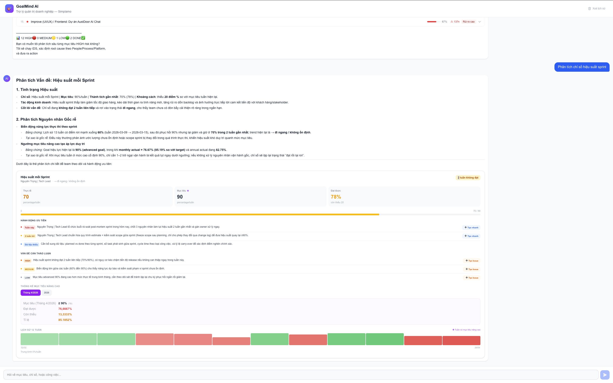

# GoalMind AI

GoalMind AI là trợ lý quản trị doanh nghiệp dùng tiếng Việt, kết nối trực tiếp với Simplamo để đọc và thao tác trên Goals/Rocks, Scorecard Metrics/KPI, Todo và Issue.

Người dùng chat tự nhiên như:

```text
Danh sách mục tiêu hiện tại?
Chỉ số nào đang off-track?
Hôm nay tôi cần làm gì?
Tạo todo gửi proposal cho khách hàng ABC, hạn thứ 6
```

Ứng dụng sẽ phân loại intent, chọn đúng agent chuyên môn, gọi Simplamo API, stream tiến trình về frontend và render kết quả thành card UI.

## Overview



## Tính năng chính

- Chat tiếng Việt với dữ liệu Simplamo thật.
- Chọn team theo số hoặc tên team ở lần đầu sử dụng.
- Đổi team bằng câu lệnh `đổi team`, `doi team`, `change team`, `reset team`.
- Phân tích Goals/Rocks theo tiến độ, milestone, deadline, risk và action cần làm.
- Phân tích Scorecard/KPI theo goal, advanced goal, trend 13 tuần, off-track severity và rollup tháng/quý/năm.
- Liệt kê, tạo và cập nhật Todo trên Simplamo.
- Tạo nhanh Todo từ action được AI đề xuất.
- Tạo nhanh Issue từ điểm cần thảo luận trong phân tích KPI.
- Stream phản hồi qua SSE, kèm trạng thái tool đang chạy.
- Render `ndjson` thành card UI theo từng dòng trong lúc AI đang stream.
- Lưu lịch sử chat ở browser bằng IndexedDB.
- Xác thực OpenAI API key từ frontend trước khi chat.

## Kiến trúc

```text
Browser / Next.js
  |
  | POST /api/chat
  | x-openai-api-key: sk-...
  | SSE stream
  v
NestJS Backend
  |
  +-- ChatController
  |     - validate OpenAI key
  |     - stream SSE events
  |
  +-- OrchestratorService
  |     - chọn team
  |     - phân loại intent
  |     - route sang specialist agent
  |
  +-- GoalAgentService
  +-- MetricsAgentService
  +-- ActionAgentService
        |
        +-- LangGraph ReAct agent
        +-- LangChain tools
        +-- ToolCacheService
        +-- SimplamoClient
              |
              v
        Simplamo REST API
```

## Tech stack

| Layer | Công nghệ |
| --- | --- |
| Backend | NestJS 11, TypeScript |
| AI orchestration | LangChain.js, LangGraph ReAct agent |
| LLM client | `@langchain/openai` |
| Frontend | Next.js 16, React 19, Tailwind CSS 4 |
| Chat UI | `@assistant-ui/react`, `@assistant-ui/react-markdown` |
| UI helpers | Radix Tooltip, lucide-react, dayjs |
| Streaming | Server-Sent Events |
| Data source | Simplamo REST API |
| Browser persistence | IndexedDB |

## Cấu trúc thư mục

```text
.
├── backend/
│   ├── src/
│   │   ├── app.module.ts
│   │   ├── main.ts
│   │   ├── chat/
│   │   │   ├── chat.controller.ts
│   │   │   └── chat.service.ts
│   │   ├── session/
│   │   │   ├── session-context.service.ts
│   │   │   └── session.module.ts
│   │   ├── simplamo/
│   │   │   ├── simplamo.client.ts
│   │   │   ├── simplamo.module.ts
│   │   │   └── types.ts
│   │   └── agents/
│   │       ├── orchestrator/
│   │       ├── goal/
│   │       ├── metrics/
│   │       ├── action/
│   │       ├── cache/
│   │       └── tools/
│   ├── package.json
│   └── .env.example
├── frontend/
│   ├── src/
│   │   ├── app/
│   │   │   ├── page.tsx
│   │   │   ├── layout.tsx
│   │   │   └── chat/page.tsx
│   │   ├── components/
│   │   │   ├── goalmind-runtime.tsx
│   │   │   ├── chat-ui.tsx
│   │   │   ├── GoalCard.tsx
│   │   │   ├── MetricCard.tsx
│   │   │   └── TodoCard.tsx
│   │   └── lib/chat-db.ts
│   └── package.json
├── goalmind_docs.md
├── goalmind_technical_docs.md
└── README.md
```

## Backend

Backend chạy trên NestJS và mặc định listen tại `http://localhost:4000`.

### Module chính

- `AppModule`: import toàn bộ module hệ thống.
- `ChatModule`: expose API chat, todo, issue, auth và reset session.
- `SessionModule`: lưu team đang chọn, danh sách team khả dụng và pending intent.
- `SimplamoModule`: cung cấp `SimplamoClient` toàn app.
- `GoalModule`, `MetricsModule`, `ActionModule`: cung cấp các specialist agent.
- `ToolCacheModule`: cache kết quả tool trong memory để giảm gọi API lặp.

### API endpoints

| Method | Endpoint | Mục đích |
| --- | --- | --- |
| `POST` | `/api/auth/validate-openai-key` | Kiểm tra OpenAI API key bằng `/v1/models` hoặc key mặc định trong env |
| `POST` | `/api/chat` | Nhận message, stream phản hồi bằng SSE |
| `POST` | `/api/session/reset` | Reset team context khi user xóa lịch sử chat |
| `POST` | `/api/todos` | Tạo nhanh Todo từ frontend |
| `PATCH` | `/api/todos/:todoId` | Cập nhật Todo |
| `POST` | `/api/issues` | Tạo nhanh Issue từ frontend |

### SSE events

`POST /api/chat` trả về `text/event-stream`. Frontend hiện xử lý các event:

```json
{ "type": "worked", "state": "analyzing", "label": "Đang phân tích yêu cầu" }
{ "type": "tool_start", "tool": "listGoals" }
{ "type": "tool_end", "tool": "listGoals" }
{ "content": "token text..." }
```

Khi stream xong, backend gửi:

```text
data: [DONE]
```

## Agents

### Orchestrator Agent

`OrchestratorService` là lớp điều phối:

- Nhận message từ `ChatService`.
- Nếu chưa có team, gọi Simplamo lấy danh sách team và yêu cầu user chọn.
- Lưu `pendingIntent` để sau khi chọn team có thể xử lý lại câu hỏi gốc.
- Phân loại intent bằng regex trước, LLM sau nếu câu hỏi mơ hồ.
- Route sang `goal`, `metrics`, `action` hoặc trả lời general.
- Nhận diện các câu xác nhận ngắn như `ok`, `có`, `làm đi` để tiếp tục intent trước đó.

Intent hợp lệ:

```text
goal     -> Goals, Rocks, OKR, milestone, tiến độ
metrics  -> Scorecard, KPI, chỉ số, trend, target
action   -> Todo, công việc, issue, việc cần làm
general  -> chào hỏi hoặc câu chưa rõ intent
```

### Goal Agent

`GoalAgentService` dùng LangGraph ReAct agent với memory thread `goal-session-default`.

Tools:

- `listGoals`: lấy danh sách Rock/Goal, có thể lọc `onlyMine`.
- `getGoalDetail`: lấy chi tiết một Rock, gồm milestone, deadline, owner, parent rock.
- `updateGoalStatus`: cập nhật trạng thái Rock sau khi đã xác nhận.

Agent được prompt để phân tích risk, expected pace, deadline, milestone bottleneck, People/Process/Platform và trả về `ndjson` cho UI.

### Metrics Agent

`MetricsAgentService` dùng ReAct agent và lấy team hiện tại từ `SessionContextService`.

Tools:

- `getScorecardMetrics`: lấy toàn bộ measurable trong Scorecard.
- `getOffTrackScorecardMetrics`: lọc metric đang lệch mục tiêu, sort theo severity.
- `getScorecardTrend`: phân tích sâu một metric trong 13 tuần, có thể kèm rollup tháng/quý/năm.

Hệ thống tự tính:

- latest value
- effective goal theo `goalAdvanced`
- achievement percentage
- consecutive off-track weeks
- severity `CRITICAL`, `WARNING`, `ON_TRACK`
- trend up/down/flat
- weekly change
- advanced goal stats

### Action Agent

`ActionAgentService` quản lý Todo trên Simplamo.

Tools:

- `listAllTodos`
- `listTodosToday`
- `listOverdueTodos`
- `createTodo`
- `updateTodo`
- `parseNaturalDate`

Todo list được tool trả về dưới dạng fenced `ndjson` để frontend render thành bảng/card thay vì markdown thường.

## Frontend

Frontend chạy Next.js App Router và mặc định mở tại `http://localhost:3000`.

### Luồng chính

- `/`: landing page ngắn với nút vào chat.
- `/chat`: màn hình chat chính.
- `ChatPage`: yêu cầu user nhập OpenAI API key, lưu key vào cookie `goalmind_openai_api_key`.
- `GoalMindRuntimeProvider`: adapter cho `@assistant-ui/react`, gửi request chat và đọc SSE stream.
- `ChatUI`: render layout chat, composer, empty state, thinking steps và clear history.
- `GoalCard`, `MetricCard`, `TodoCard`: render dữ liệu có cấu trúc từ AI.

### NDJSON rendering

Backend/agent trả các block dạng:

````text
```ndjson
{"_ndjson":"scorecard-overview","total":3,"onTrack":1,"warning":1,"critical":1,"noData":0}
{"id":"...","title":"Doanh thu tuần","unit":"number","owner":"..."}
```
````

Frontend parse từng dòng JSON hoàn chỉnh bằng `parseAllSegments()` trong `chat-ui.tsx`.

Các schema đang hỗ trợ:

| Schema | Component render |
| --- | --- |
| `goal-list` | `GoalListView` |
| `goal-detail` | `GoalCardList` |
| `scorecard-overview` | `ScorecardOverviewView` |
| `scorecard-offtrack` | `ScorecardOfftrackView` |
| `scorecard-trend` | `ScorecardTrendView` |
| `todo-list` | `TodoListView` |

## Biến môi trường

### Backend

Tạo file `backend/.env` từ file mẫu:

```bash
cp backend/.env.example backend/.env
```

Các biến đang được code sử dụng:

```env
SIMPLAMO_API_TOKEN=your_token_here
SIMPLAMO_TEAM_ID=your_default_team_id
SIMPLAMO_SESSION_ID=your_default_session_id
OPENAI_API_KEY=sk-your_key_here
FRONTEND_URL=http://localhost:3000
PORT=4000
```

Các biến có fallback trong code nhưng nên cấu hình nếu chạy với workspace/company khác:

```env
SIMPLAMO_OWNER_ID=your_default_owner_id
SIMPLAMO_COMPANY_ID=your_company_id
OPENAI_BASE_URL=https://api.openai.com
```

Ghi chú:

- `SIMPLAMO_API_TOKEN` được dùng bởi `SimplamoClient`.
- `SIMPLAMO_TEAM_ID` là team fallback nếu chưa có team trong session.
- `SIMPLAMO_SESSION_ID` dùng cho Goal/Rock theo quarter/session.
- `OPENAI_API_KEY` là key mặc định để backend validate nhanh nếu frontend nhập đúng key này.
- `OPENAI_BASE_URL` là tùy chọn nếu dùng proxy OpenAI-compatible.

### Frontend

Repo hiện có `frontend/.env` rỗng. Có thể tạo `frontend/.env.local` nếu backend không chạy ở port mặc định:

```env
NEXT_PUBLIC_API_URL=http://localhost:4000
```

Nếu không khai báo, frontend tự dùng `http://localhost:4000`.

## Cài đặt và chạy local

Yêu cầu:

- Node.js tương thích với Next.js 16 và NestJS 11.
- npm.
- Simplamo API token hợp lệ.
- OpenAI API key hợp lệ.

### 1. Cài backend

```bash
cd backend
npm install
cp .env.example .env
npm run start:dev
```

Backend chạy tại:

```text
http://localhost:4000
```

### 2. Cài frontend

Mở terminal khác:

```bash
cd frontend
npm install
npm run dev
```

Frontend chạy tại:

```text
http://localhost:3000
```

### 3. Sử dụng

1. Mở `http://localhost:3000/chat`.
2. Nhập OpenAI API key.
3. Chọn team khi hệ thống hỏi.
4. Chat bằng tiếng Việt.

## Scripts

### Backend

```bash
npm run start:dev   # dev server NestJS
npm run build       # build production
npm run start:prod  # chạy dist/main
npm run lint        # eslint --fix
npm run test        # unit tests
npm run test:e2e    # e2e tests
```

### Frontend

```bash
npm run dev     # dev server Next.js
npm run build   # production build
npm run start   # chạy production server
npm run lint    # eslint
```

## Ví dụ câu hỏi

### Goals/Rocks

```text
Danh sách mục tiêu hiện tại?
Liệt kê danh sách mục tiêu của tôi
Goal nào đang dưới 50% mà gần deadline?
Phân tích sâu rock số 3
Cập nhật rock số 5 thành DONE
```

### Metrics/KPI

```text
Chỉ số nào đang off-track?
Liệt kê danh sách chỉ số của team
KPI của tôi tuần này thế nào?
Phân tích xu hướng chỉ số doanh thu
Chỉ số nào đang nghiêm trọng nhất?
```

### Actions/Todo

```text
Tôi cần làm gì hôm nay?
Liệt kê toàn bộ todo
Todo nào đang trễ hạn?
Tạo todo gọi khách hàng ABC hạn thứ 6, ưu tiên cao
Đánh dấu todo "Gửi proposal" là DONE
```

## Lưu ý vận hành

- Session team hiện là singleton trong backend process, phù hợp demo/local hơn là multi-user production.
- Chat history lưu ở IndexedDB trên browser, không có database riêng.
- Xóa lịch sử chat trên frontend sẽ gọi `/api/session/reset` để reset team context backend.
- Tool cache là in-memory TTL cache, mất khi restart backend.
- Frontend lưu OpenAI API key trong cookie `goalmind_openai_api_key` trong 30 ngày.
- Backend validate OpenAI key bằng endpoint `/v1/models`; cần network ra OpenAI hoặc proxy tương thích.
- Simplamo API base URL đang hardcode là `https://api.simplamo.com/api`.

## Tài liệu thêm

- `goalmind_docs.md`: giải thích chi tiết theo luồng học để hiểu.
- `goalmind_technical_docs.md`: tài liệu kỹ thuật tổng hợp sâu hơn về kiến trúc, ReAct agent, tool calling và streaming.
